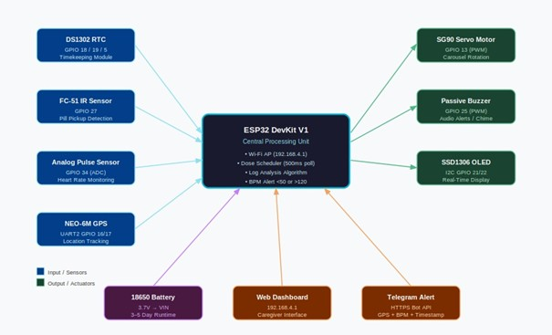
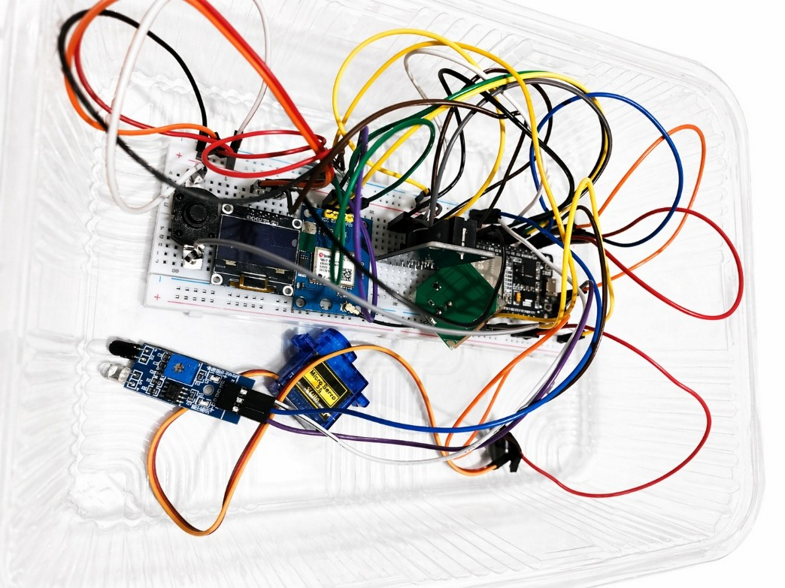
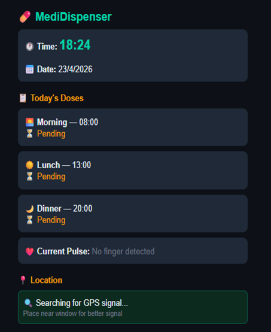

# 💊 Smart Medicine Dispenser

### IoT-Enabled Automated Medicine Dispenser with Real-Time Health Monitoring & Emergency Response System

---

## 📌 Overview

The Smart Medicine Dispenser is an IoT-based healthcare system designed to help elderly patients, hospital inpatients, and cognitively disabled individuals take medicines on time safely and efficiently.
The system automates medicine dispensing, monitors heart rate, detects missed doses, and triggers emergency alerts when abnormal conditions are detected.
This project was developed as part of the Community Engagement Project (CEP) at Ramdeobaba University, Nagpur.

## 🚨 Problem Statement

Medication non-adherence is a major healthcare challenge among elderly and chronically ill patients.
Common issues include:
- missed medicine doses
- incorrect timing
- accidental overdose
- lack of caregiver supervision
Existing commercial smart dispensers are expensive and often require continuous internet connectivity.

---

## 💡 Proposed Solution

This project provides a low-cost ESP32-based smart medicine dispenser that:
- Automatically dispenses medicine at scheduled times
- Detects whether medicine was taken
- Measures heart rate after dispensing
- Triggers emergency alerts for critical situations
- Provides GPS location tracking
- Hosts an offline-accessible web dashboard

---

## ⚙️ Features
- ⏰ Automated medicine dispensing
- ❤️ Heart rate monitoring
- 📍 GPS location tracking
- 🔔 Buzzer alert notifications
- 👁️ IR-based medicine pickup detection
- 📱 ESP32 web dashboard
- 🚨 Decision-based emergency alert system
- 🔋 Portable low-power operation

---

## 🛠️ Hardware Components
| Component | Purpose |
|---|---|
| ESP32 DevKit V1 | Main controller |
| SG90 Servo Motor | Carousel rotation |
| DS1302 RTC Module | Real-time scheduling |
| FC-51 IR Sensor | Medicine pickup detection |
| Pulse Sensor | Heart rate monitoring |
| NEO-6M GPS Module | GPS tracking |
| SSD1306 OLED | Display output |
| Passive Buzzer | Audio alerts |

---

## 🔌 GPIO Connections

| GPIO Pin | Connected Device |
|---|---|
| GPIO 13 | Servo Motor |
| GPIO 18 | RTC CLK |
| GPIO 19 | RTC DAT |
| GPIO 5 | RTC RST |
| GPIO 21 | OLED SDA |
| GPIO 22 | OLED SCL |
| GPIO 16 | GPS RX |
| GPIO 17 | GPS TX |
| GPIO 27 | IR Sensor |
| GPIO 34 | Pulse Sensor |
| GPIO 25 | Buzzer |
---

## 🧠 Emergency Alert Logic

The system uses a decision-based emergency model.(WOuld Be Using a GSM Module For Communication Protocol)
An emergency alert is triggered only when:
- the medicine dose is missed
- AND abnormal heart rate is detected simultaneously
This helps reduce false emergency alerts and improves caregiver response efficiency.

---

## 🌐 Web Interface

The ESP32 creates its own WiFi hotspot allowing users to access the dashboard without internet connectivity.
Dashboard features:
- Medicine scheduling
- Dose status monitoring
- Heart rate logs
- GPS location tracking
- Real-time updates

---

## 📷 Project Images

### System Block Diagram

### Working Prototype

### Web Interface

---

## 🔮 Future Scope

- Mobile application integration
- AI-based health anomaly prediction
- Cloud database support
- GSM-based emergency alerts
- Multi-patient support
- Expanded medicine compartments

---

## 👨‍💻 Authors

- Soham Kharabe
-Ramdeobaba University, Nagpur

---

## 📄 Copyright
© 2026 Soham Kharabe and Team.  
All rights reserved.

This project and its source code may not be copied, modified, distributed, or used commercially without explicit permission from the authors.
Also IMPORTANT
